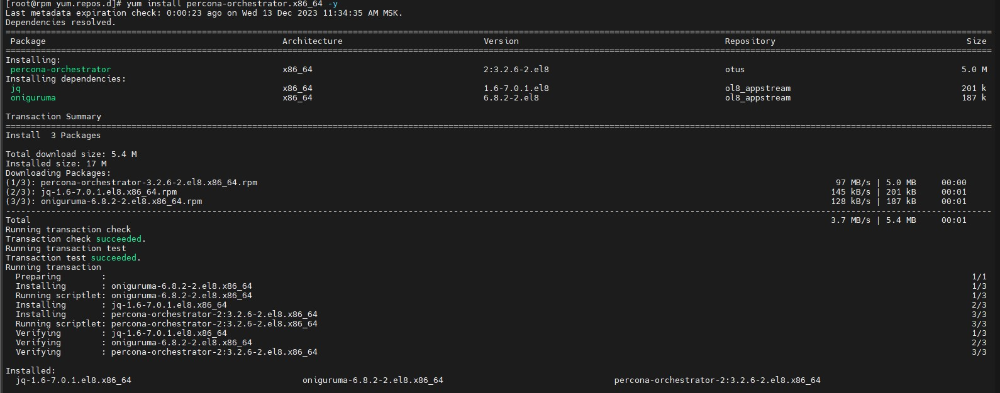

## В папке rpm весь набор файлов и скриптов для выполнения ДЗ:
#### - ./Vagrantfile - инициализация и установка вирутальной машины - vagrant up
#### - ./scripts/baseconf.sh подключается в Vagrantfile для базовой инициализации параметров VM
#### - ./scripts/custom.sh подключается в Vagrantfile для кастомизации сервера rpm

#### Ниже приведены срины выполнения ДЗ

