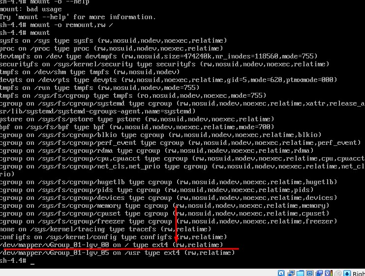
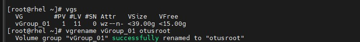
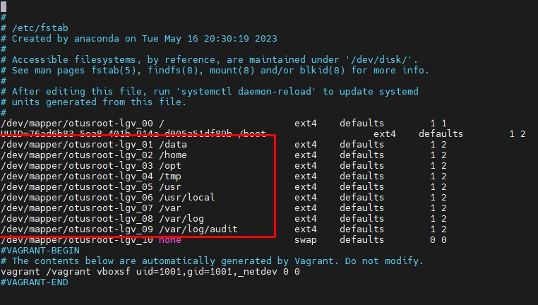
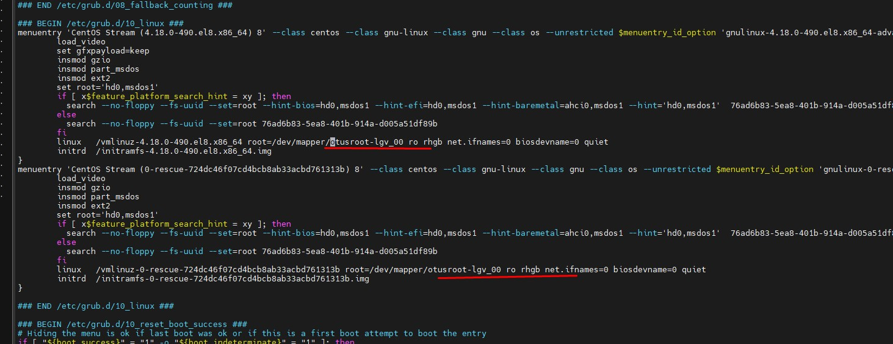
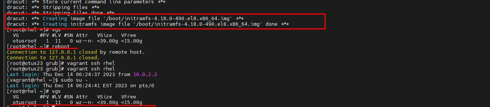
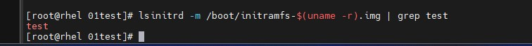

## В папке grub весь набор файлов и скриптов для выполнения ДЗ:
#### - Vagrantfile - инициализация и установка 2-х вирутальный машин (ubuntu и centos). Думал поделать тесты на 2=х ВМ, в итоге делал только на CentOS-8

#### Ниже приведены срины выполнения ДЗ

#### Вход в систему без пароля и монтирование / в режиме RW

#### Перебиваем волюм группу в файлах /etc/fstab, /etc/default/grub, /boot/grub2/grub.cfg

#### Пересобираем файл initrd image и далее перегружаемся

#### Создаем и добавляем свои модули для initrd
