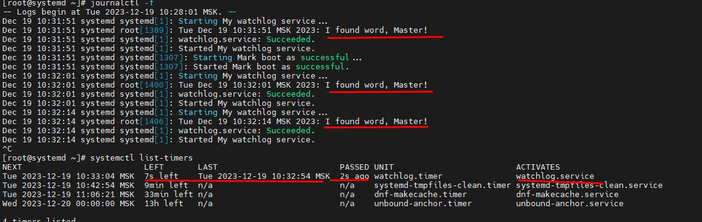
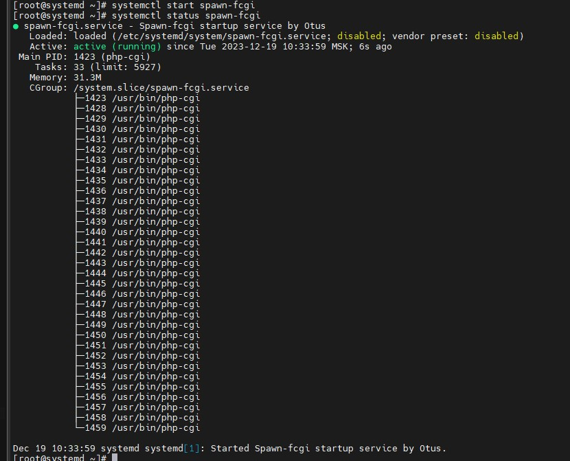
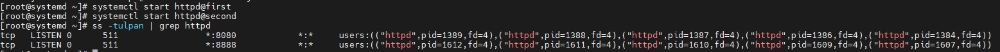

## В папке systemd  весь набор файлов и скриптов для выполнения ДЗ:
#### - Vagrantfile - инициализация и установка вирутальной машины
#### - ./scripts/baseconf.sh подключается в Vagrantfile для базовой инициализации параметров VM
#### - ./scripts/custom.sh подключается в Vagrantfile для кастомной конфигурации параметров VM
#### - ./files/* файлы для конфигурации сервисов внутри VM (для выполнения ДЗ)

### Ниже приведены срины выполнения ДЗ

#### Сервис watchlog

#### Сервис spawn-fcgi

#### Сервисы httpd

